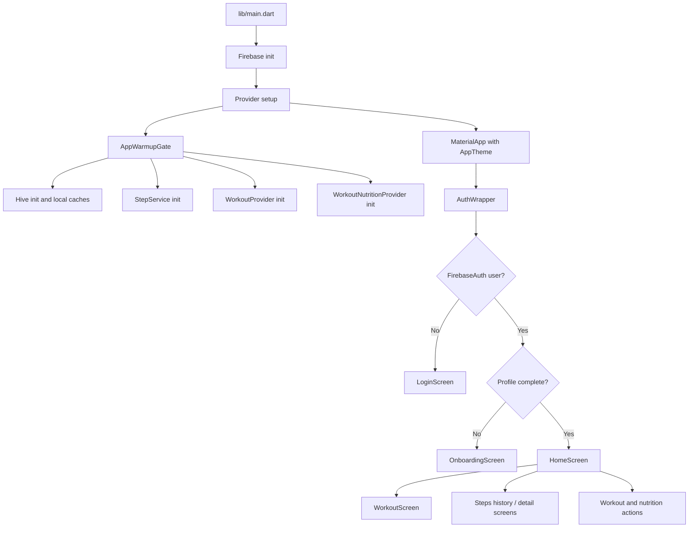
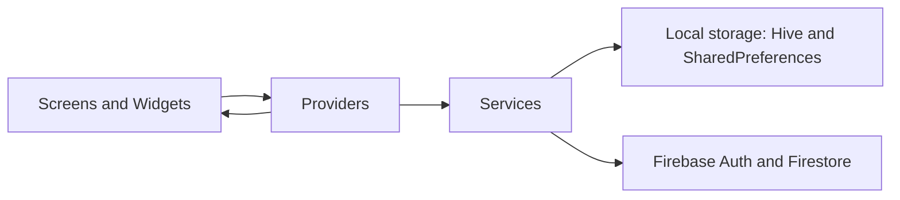

# Brutl Understanding

This file is a high-level map of the Brutl app codebase. It explains how the app starts, how data moves through the providers and services, and what each file is responsible for.

## What The App Does

Brutl is a fitness-focused Flutter app that combines:

- Authentication with email/password and Google sign-in
- Onboarding for profile, body metrics, workout split, and nutrition goals
- Daily step tracking with local persistence and Firestore sync
- Workout logging, exercise editing, and split-based program navigation
- Nutrition tracking with macro dashboards and meal logging
- A dark branded UI system built around a consistent design token layer

## App Flow

## Main Runtime Path

### Startup

1. `lib/main.dart` initializes Flutter bindings and Firebase.
2. `BrutlAppBootstrap` registers the app-wide providers.
3. `AppWarmupGate` runs a background warmup so local storage and workout data are ready early.
4. `BrutlApp` builds the themed `MaterialApp`.
5. `AuthWrapper` decides whether the user sees login, onboarding, or the home screen.

### Session Routing

- If there is no signed-in user, the app shows the login screen.
- If the user is signed in but the profile is incomplete, the app shows onboarding.
- If the profile is complete, the app goes to the home screen.

### Data Sources

- Firebase Auth handles identity.
- Firestore stores user profile and workout sync data.
- Hive stores local exercise and step history caches.
- SharedPreferences stores lightweight app state such as step baselines and workout preferences.
- Pedometer provides raw step count streams.

## File-by-File Guide

### Entry and app bootstrap

- [lib/main.dart](lib/main.dart) is the app entry point. It initializes Firebase, registers providers, warms up Hive and step tracking, and routes the user into auth, onboarding, or home.
- [lib/core/theme/app_theme.dart](lib/core/theme/app_theme.dart) defines the dark Material theme, page transitions, form styling, and button styling.
- [lib/core/theme/app_colors.dart](lib/core/theme/app_colors.dart) stores the app color palette.
- [lib/core/theme/app_gradients.dart](lib/core/theme/app_gradients.dart) stores reusable gradient tokens.
- [lib/core/theme/app_text_styles.dart](lib/core/theme/app_text_styles.dart) defines the typography scale using Poppins.
- [lib/core/theme/theme_extensions.dart](lib/core/theme/theme_extensions.dart) exposes theme tokens through `BuildContext` so UI code can stay consistent.
- [lib/core/theme/app_spacing.dart](lib/core/theme/app_spacing.dart) defines spacing and radius tokens used throughout the UI.

### Providers and state

- [lib/providers/auth_provider.dart](lib/providers/auth_provider.dart) manages authentication actions such as email sign-in, sign-up, Google sign-in, sign-out, OTP stub handling, password reset, loading state, and auth error messages.
- [lib/providers/auth_validation_provider.dart](lib/providers/auth_validation_provider.dart) handles live password validation, password visibility toggles, sign-up validation rules, login error state, and reset logic for auth forms.
- [lib/providers/health_provider.dart](lib/providers/health_provider.dart) contains the `StepProvider`, which manages step tracking state, permission checks, calorie estimation, local persistence, Firebase syncing, and recovery when sensor updates fail.
- [lib/providers/workout_provider.dart](lib/providers/workout_provider.dart) owns the main workout dashboard state, user profile hydration, workout split selection, week selection, program day generation, step and calorie summaries, and live Firestore user updates.
- [lib/providers/workout_nutrition_provider.dart](lib/providers/workout_nutrition_provider.dart) manages the nutrition dashboard, meal calories, macro totals, bottom navigation state, and live Firestore profile refresh for nutrition goals.

### Services and persistence

- [lib/services/step_service.dart](lib/services/step_service.dart) is the low-level step engine. It listens to the pedometer stream, calculates today’s steps from a baseline, persists local step state, and syncs the counters to Firestore.
- [lib/services/step_sensor_service.dart](lib/services/step_sensor_service.dart) sits below `StepProvider` and wraps sensor listening, stream normalization, and daily reset behavior.
- [lib/services/local_storage_service.dart](lib/services/local_storage_service.dart) stores and retrieves local step history, including daily and weekly aggregations for charts.
- [lib/services/database_service.dart](lib/services/database_service.dart) is the local-first workout data service. It writes exercises to Hive first, syncs them to Firestore in the background, fetches user profiles, and restores workouts from the server.
- [lib/services/background_service.dart](lib/services/background_service.dart) contains background execution support for tasks that need to keep running outside the foreground UI.

### Repository layer

- [lib/repositories/workout_repository.dart](lib/repositories/workout_repository.dart) is a thin wrapper over `DatabaseService`. It gives the workout feature a cleaner abstraction for saving and reading exercises.

### Models

- [lib/models/user_model.dart](lib/models/user_model.dart) defines the basic user model used by parts of the UI and persistence layer.
- [lib/models/user_data_models.dart](lib/models/user_data_models.dart) contains the simpler app-facing models for user profile, workout plan, exercise, and home UI text configuration.
- [lib/models/brutl_models.dart](lib/models/brutl_models.dart) contains the richer workout and nutrition domain models, including macros, nutrition totals, exercise records, workout splits, sessions, program days, and UI metadata.

### Screens and navigation

- [lib/Screens/auth/auth_screen.dart](lib/Screens/auth/auth_screen.dart) is the animated authentication screen with the blurred dark background, email form, and Google sign-in button.
- [lib/Screens/auth/login_screen.dart](lib/Screens/auth/login_screen.dart) is the login form screen.
- [lib/Screens/auth/sign_up_screen.dart](lib/Screens/auth/sign_up_screen.dart) is the account creation screen.
- [lib/Screens/auth/forgot_password_screen.dart](lib/Screens/auth/forgot_password_screen.dart) is the password reset entry screen.
- [lib/Screens/onboarding/onboarding_screen.dart](lib/Screens/onboarding/onboarding_screen.dart) collects profile data, body metrics, split preferences, activity goals, and macro targets before marking onboarding complete.
- [lib/Screens/home_screen.dart](lib/Screens/home_screen.dart) is the main post-login dashboard. It contains the home tab, workout tab, shop placeholder, and chat placeholder, plus the step permission prompt and resume sync behavior.
- [lib/Screens/workout_screen.dart](lib/Screens/workout_screen.dart) shows the workout and nutrition dashboard, week selector, macro summary, and workout cards.
- [lib/Screens/workout_detail_screen.dart](lib/Screens/workout_detail_screen.dart) shows the exercises in a single workout session and opens the editor sheet for each exercise.
- [lib/Screens/day_detail_screen.dart](lib/Screens/day_detail_screen.dart) is the Firestore-backed day editor. It reads and writes exercises for a specific week/day document in real time.
- [lib/Screens/permission_gate_screen.dart](lib/Screens/permission_gate_screen.dart) requests Activity Recognition permission and only proceeds once step tracking is allowed, or lets the user continue after skipping.
- [lib/Screens/steps_history_screen.dart](lib/Screens/steps_history_screen.dart) renders the weekly step history chart using `fl_chart` and local step storage.

### Widgets

- [lib/widgets/header_widget.dart](lib/widgets/header_widget.dart) renders the home header, greeting, date, and branded title block.
- [lib/widgets/exercise_highlight_card.dart](lib/widgets/exercise_highlight_card.dart) renders the highlighted exercise card with image, sets, reps, and weight.
- [lib/widgets/macro_dashboard_card.dart](lib/widgets/macro_dashboard_card.dart) renders the large nutrition circle and the three macro progress circles.
- [lib/widgets/workout_card_widget.dart](lib/widgets/workout_card_widget.dart) renders a workout card for a day/session entry.
- [lib/widgets/workout_day_card.dart](lib/widgets/workout_day_card.dart) renders a day summary card for workout planning views.
- [lib/widgets/password_input_field.dart](lib/widgets/password_input_field.dart) is a reusable password field with visibility toggling.
- [lib/widgets/otp_verification_sheet.dart](lib/widgets/otp_verification_sheet.dart) is the OTP entry bottom sheet used by the auth flow.
- [lib/widgets/meal_logger_sheet.dart](lib/widgets/meal_logger_sheet.dart) is the modal sheet for logging meal calories and macro totals.
- [lib/widgets/exercise_editor_sheet.dart](lib/widgets/exercise_editor_sheet.dart) is the modal editor for creating and updating exercises.
- [lib/widgets/biometric_card.dart](lib/widgets/biometric_card.dart) displays biometric or body metric information in a card format.

## How The Pieces Work Together

### Authentication and onboarding

The user authenticates through the auth screens and `BrutlAuthProvider`. Once signed in, `AuthWrapper` checks the Firestore user document. If the profile is incomplete, `OnboardingScreen` collects the missing profile and goal data, then the app proceeds into the main dashboard.

### Workout data flow

Workout data is centered on `WorkoutProvider`, `WorkoutNutritionProvider`, `WorkoutRepository`, and `DatabaseService`. The app writes exercise changes locally first, then syncs them to Firestore so the UI stays fast and offline-friendly. The workout screens and editor sheets read from those providers rather than talking directly to storage.

### Step tracking flow

`StepProvider` and `StepService` manage the daily step count. `StepService` listens to the pedometer stream and keeps a normalized day counter. `StepProvider` turns that into UI state, calorie estimation, permission handling, local history, and Firestore sync.

### UI system

The UI is intentionally dark, branded, and consistent. The theme files define the color, gradient, spacing, and typography tokens, and the widgets/screens reuse those tokens instead of inventing one-off styles. That keeps the app visually coherent across auth, home, workout, onboarding, and analytics views.

## Quick Mental Model

If you want the shortest way to understand the codebase, think of it like this:

- `main.dart` starts everything.
- Providers own screen state.
- Services talk to sensors, local storage, and Firebase.
- Screens build UI from provider state.
- Widgets are reusable visual building blocks.
- Models define the data shape shared across the app.
- Theme files keep the whole app visually consistent.

## Notes

- Some files are architectural glue and mostly forward data rather than inventing new behavior.
- The app uses both local persistence and Firestore sync, so a lot of code is designed to keep the UI responsive while syncing in the background.

